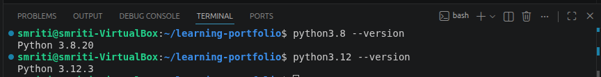
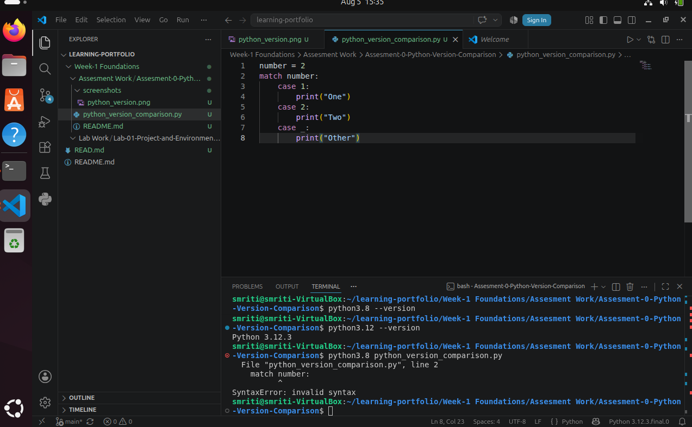

# Assessment 0 – Python Version Comparison

## Overview

This assessment demonstrates the installation and configuration of multiple Python versions on Ubuntu and compares language compatibility between Python 3.8 and Python 3.12 using the `match-case` statement.

---

## Problem Statement

The objective of this assessment was to install Python 3.8 and Python 3.12 on Ubuntu, verify both installations, and compare their language features. A sample Python program using the `match-case` statement was developed and executed using both Python versions to demonstrate version-specific compatibility. The assessment highlights the importance of selecting the correct Python interpreter when using features introduced in newer releases.

---

## Objectives

- Install Python 3.8 and Python 3.12 on Ubuntu.
- Verify both Python installations.
- Develop a Python program using the `match-case` statement.
- Execute the program using Python 3.8.
- Execute the program using Python 3.12.
- Compare the outputs.
- Document the results using screenshots.

---

## Technologies Used

- Ubuntu Linux
- Python 3.8
- Python 3.12
- Visual Studio Code
- Git
- GitHub

---

## Repository Structure

```text
Assessment-0-Python-Version-Comparison/
│
├── README.md
├── python_version_comparison.py
└── screenshots/
    ├── python_version.png
    ├── python38_syntax_error.png
    └── python312_successfull_output.png
```

---

## Program Implementation

```python
number = 2

match number:
    case 1:
        print("One")
    case 2:
        print("Two")
    case _:
        print("Other")
```

The program uses the `match-case` statement to determine the output based on the value of `number`.

---

## Execution

### Step 1: Verify Installed Python Versions

Commands:

```bash
python3.8 --version
python3.12 --version
```

Expected Output

```text
Python 3.8.20
Python 3.12.3
```

---

### Step 2: Execute Using Python 3.8

Command

```bash
python3.8 python_version_comparison.py
```

Output

```text
SyntaxError: invalid syntax
```

**Observation**

Python 3.8 does not support the `match-case` statement because it was introduced in Python 3.10. Therefore, the interpreter raises a `SyntaxError`.

---

### Step 3: Execute Using Python 3.12

Command

```bash
python3.12 python_version_comparison.py
```

Output

```text
Two
```

**Observation**

Python 3.12 fully supports the `match-case` statement and executes the program successfully.

---

## Output Summary

| Python Version | Result | Observation |
|----------------|--------|-------------|
| Python 3.8 | ❌ Failed | `match-case` is not supported and raises a `SyntaxError`. |
| Python 3.12 | ✅ Successful | Program executes correctly and prints **Two**. |

---

# Screenshots

## 1. Python Version Verification

Verified the successful installation of Python 3.8 and Python 3.12 on Ubuntu.



---

## 2. Python 3.8 Execution

Execution using Python 3.8 results in a **SyntaxError** because the `match-case` statement is not supported in versions earlier than Python 3.10.



---

## 3. Python 3.12 Execution

Execution using Python 3.12 completes successfully because the `match-case` statement is supported.


---

## Learning Outcomes

After completing this assessment, I learned to:

- Install multiple Python versions on Ubuntu.
- Verify Python interpreter versions.
- Execute Python programs using specific interpreter versions.
- Compare language features across Python versions.
- Understand version compatibility issues.
- Organize project files using Git and GitHub.
- Document technical work using Markdown.

---

## Resources Used

- Python Official Documentation – https://python.org
- Python Language Reference
- Ubuntu Documentation
- Git Documentation
- Visual Studio Code Documentation

---

## Conclusion

This assessment demonstrated the practical differences between Python 3.8 and Python 3.12 by using the `match-case` statement. The results confirmed that Python language features are version-dependent, emphasizing the importance of using a compatible interpreter when developing Python applications.
