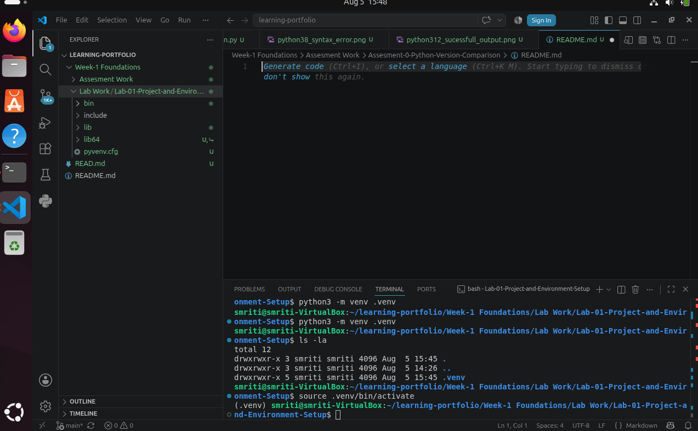
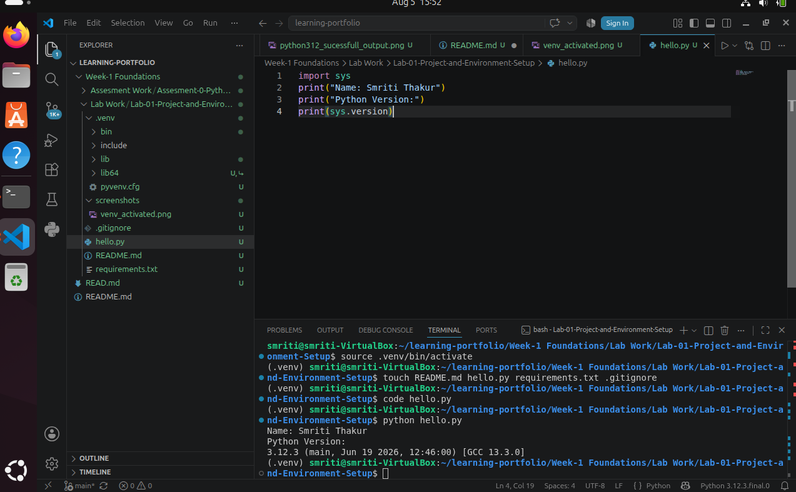

# Lab 01 – Project and Environment Setup

## Overview

This lab focuses on setting up a clean and reproducible Python development environment on Ubuntu. It covers creating a project structure, configuring a virtual environment, managing dependencies, and documenting the project using Git and GitHub.

---

## Problem Statement

The objective of this lab was to create a Python project following standard development practices. The project required creating an isolated virtual environment, developing a simple Python program to display the user's name and Python version, recording installed packages, organizing project files, and documenting the setup for future reproducibility.

---

## Objectives

- Create a Python project directory.
- Create and activate a virtual environment.
- Create a `README.md` file.
- Create a `.gitignore` file.
- Create an empty `requirements.txt`.
- Develop a simple Python program.
- Record installed packages.
- Document the project with screenshots.

---

## Technologies Used

- Ubuntu Linux
- Python 3.12
- Python Virtual Environment (venv)
- Visual Studio Code
- Git
- GitHub

---

## Repository Structure

```text
Lab-01-Project-and-Environment-Setup/
│
├── README.md
├── hello.py
├── requirements.txt
└── screenshots/
    ├── venv_activated.png
    └── hello_program_output.png
```

---

## Implementation

### Step 1: Create Project Directory

A dedicated project directory was created to organize all project files.

---

### Step 2: Create Virtual Environment

A virtual environment was created using:

```bash
python3 -m venv .venv
```

The environment was activated using:

```bash
source .venv/bin/activate
```

---

### Step 3: Create Project Files

The following files were created:

- README.md
- .gitignore
- requirements.txt
- hello.py

---

### Step 4: Python Program

The following Python program was developed.

```python
import sys

print("Name: Smriti Thakur")
print("Python Version:")
print(sys.version)
```

The program displays the user's name and the currently active Python version.

---

### Step 5: Record Installed Packages

Installed packages were recorded using:

```bash
pip freeze > requirements.txt
```

---

## Output

### Program Execution

Command

```bash
python hello.py
```

Output

```text
Name: Smriti Thakur
Python Version:
3.12.x
```

The program successfully displayed the user's name and the active Python version.

---

## Screenshots

### 1. Virtual Environment Activated

The virtual environment was successfully created and activated before running the Python program.



---

### 2. Program Output

Execution of `hello.py` displaying the user's name and the Python version.



---

## Learning Outcomes

After completing this lab, I learned how to:

- Create a Python project structure.
- Create and activate a virtual environment.
- Isolate project dependencies using `venv`.
- Execute Python programs inside a virtual environment.
- Generate a `requirements.txt` file.
- Organize project files following standard practices.
- Use Git and GitHub for project version control.
- Document projects using Markdown.

---

## Resources Used

- Python Official Documentation – https://python.org
- Python Virtual Environment Documentation
- Ubuntu Documentation
- Git Documentation
- Visual Studio Code Documentation

---

## Conclusion

This lab provided practical experience in setting up a clean and reproducible Python development environment. It reinforced the importance of virtual environments, dependency management, project organization, and documentation, which are essential practices in professional Python development.