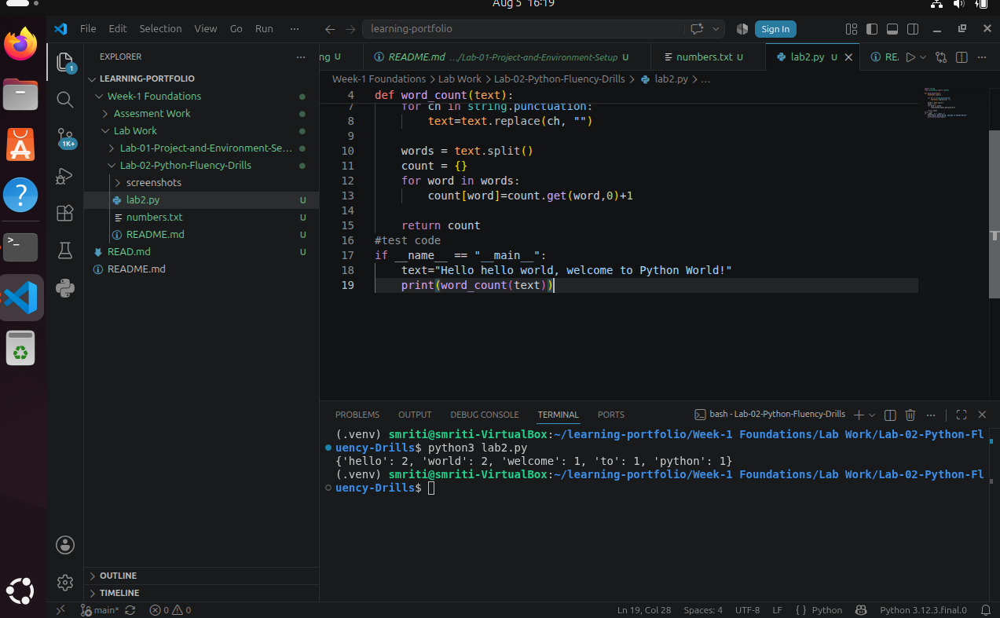
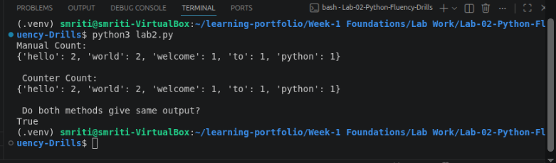
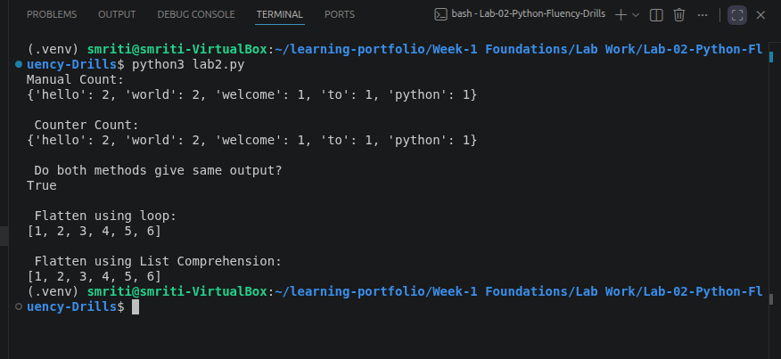

# Lab 02 – Python Fluency Drills

## Overview

This lab focuses on strengthening Python programming fundamentals by implementing commonly used programming techniques such as word counting, list flattening, file handling, and exception handling. The lab also demonstrates multiple approaches to solving the same problem using Python's built-in libraries and language features.

---

## Problem Statement

The objective of this lab was to improve Python programming fluency by implementing reusable functions, practicing list comprehensions, utilizing the `collections.Counter` module, reading numerical data from files, and handling common runtime exceptions. Different implementations were compared to understand Pythonic approaches and improve code readability and efficiency.

---

## Objectives

- Implement manual word counting using dictionaries.
- Count words using Python's `collections.Counter`.
- Compare outputs of both methods.
- Flatten nested lists using loops.
- Flatten nested lists using list comprehension.
- Read numerical values from a text file.
- Calculate the mean of numbers stored in a file.
- Handle invalid input and missing file exceptions.
- Document outputs with screenshots.

---

## Technologies Used

- Ubuntu Linux
- Python 3.12
- Visual Studio Code
- Git
- GitHub

---

## Repository Structure

```text
Lab-02-Python-Fluency-Drills/
│
├── README.md
├── lab2.py
├── numbers.txt
└── screenshots/
    ├── word_count_output.png
    ├── counter_output.png
    ├── flatten_output.png
    └── mean_of_file-missing_file_input.png
```

---

## Implementation

### Task 1 – Manual Word Count

A function was implemented using a Python dictionary to count the occurrence of each word after converting the text to lowercase and removing punctuation.

---

### Task 2 – Word Count Using `collections.Counter`

The same problem was solved using Python's built-in `Counter` class from the `collections` module. The outputs of both approaches were compared to verify correctness.

---

### Task 3 – Flatten Nested Lists

A nested list was flattened using two approaches:

- Traditional nested loops
- List comprehension

Both methods produced identical outputs.

---

### Task 4 – Mean of Numbers in a File

A function was implemented to:

- Read numbers from a text file.
- Convert each value to a floating-point number.
- Calculate the arithmetic mean.
- Ignore invalid values.
- Handle missing files using exception handling.

---

## Output

### Word Count

The manual dictionary implementation correctly counted the frequency of each word after removing punctuation and converting all text to lowercase.

---

### Counter Output

The `Counter` implementation produced the same results as the manual implementation, demonstrating a simpler and more efficient approach.

---

### Flatten Nested List

Input

```python
[[1,2],[3,4],[5,6]]
```

Output

```text
[1, 2, 3, 4, 5, 6]
```

Both the loop-based and list-comprehension approaches generated identical flattened lists.

---

### Mean of File

Input File

```text
10
20
30
40
50
```

Output

```text
30.0
```

When a missing file was provided, the program handled the exception gracefully and displayed an appropriate error message.

---

## Screenshots

### 1. Manual Word Count Output

The program successfully counted the frequency of words using a dictionary implementation.



---

### 2. Counter Output

The `collections.Counter` implementation produced the same output as the manual dictionary implementation.



---

### 3. Flatten Nested List Output

The nested list was successfully flattened using both loops and list comprehension.



---

### 4. Mean of Numbers and Missing File Handling

The program correctly calculated the mean of numbers from the input file and handled missing file exceptions gracefully.


---

## Learning Outcomes

After completing this lab, I learned to:

- Create reusable Python functions.
- Use dictionaries for frequency counting.
- Utilize the `collections.Counter` module.
- Apply list comprehensions effectively.
- Process text by removing punctuation and converting to lowercase.
- Read data from text files.
- Perform basic statistical calculations.
- Handle exceptions using `try` and `except`.
- Write cleaner and more Pythonic code.

---

## Resources Used

- Python Official Documentation – https://python.org
- Python Standard Library Documentation
- Ubuntu Documentation
- Git Documentation
- Visual Studio Code Documentation

---

## Conclusion

This lab strengthened my understanding of core Python programming concepts through practical implementation of text processing, list manipulation, file handling, and exception handling. It also demonstrated how Python's built-in libraries can simplify common programming tasks while improving code readability and maintainability.