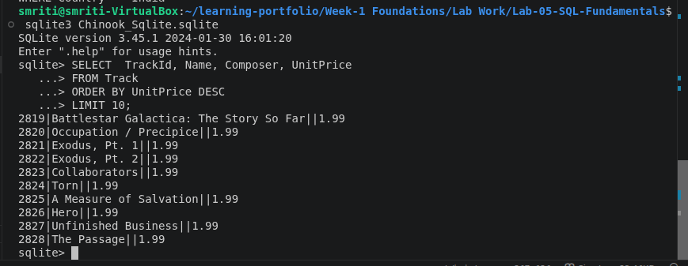
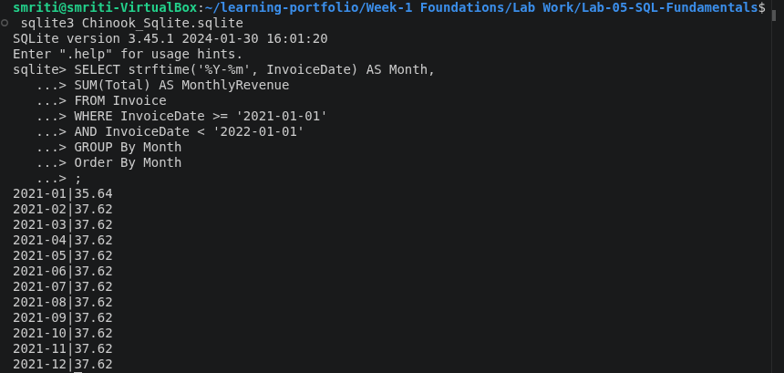

# Lab 05 – SQL Fundamentals

## Overview

This lab focuses on learning and applying fundamental SQL concepts using the Chinook SQLite sample database. The lab covers querying relational data, filtering records, sorting results, performing aggregations, grouping data, joining related tables, and working with date-based queries.

---

## Problem Statement

The objective of this lab was to use SQL to answer practical questions from the Chinook relational database. The tasks involved retrieving customers from a specific country, identifying the most expensive tracks, calculating revenue by country, finding the best-selling tracks, and analyzing monthly revenue for a selected year.

---

## Objectives

- Understand and practice fundamental SQL queries.
- Retrieve and filter records using `SELECT` and `WHERE`.
- Sort and limit query results using `ORDER BY` and `LIMIT`.
- Perform calculations using aggregate functions such as `SUM()`.
- Group records using `GROUP BY`.
- Join related tables using `INNER JOIN`.
- Perform date-based analysis using SQLite date functions.
- Save SQL queries in separate `.sql` files.
- Document query results using screenshots.

---

## Technologies Used

- Ubuntu Linux
- SQLite 3
- Chinook SQLite Database
- Visual Studio Code
- Bash Terminal
- SQL
- Git
- GitHub

---

## Database Used

The **Chinook SQLite sample database** was used for this lab.

The database contains relational tables including:

- Customer
- Invoice
- InvoiceLine
- Track
- Album
- Artist
- Genre
- Employee
- MediaType
- Playlist
- PlaylistTrack

---

## Implementation

### Step 1: Set Up the Chinook Database

The Chinook SQLite sample database was downloaded and opened using the SQLite command-line interface.

The available tables were verified using:

```sql
.tables
```

The database contains tables for customers, invoices, tracks, artists, albums, playlists, and other related entities.

---

### Step 2: Customers by Country

Customers from India were retrieved using the `WHERE` clause.

```sql
-- Insight: This query lists all customers from India.

SELECT CustomerId, FirstName, LastName, Email, Country
FROM Customer
WHERE Country = 'India';
```

The query successfully returned the customers belonging to India.

**SQL File:** [01_customer_by_country.sql](./sql/01_customer_by_country.sql)

**Screenshot:**


---

### Step 3: Most Expensive Tracks

The 10 tracks with the highest unit prices were identified using `ORDER BY` and `LIMIT`.

```sql
-- Insight: This query identifies the 10 tracks with the highest unit price.

SELECT TrackId, Name, Composer, UnitPrice
FROM Track
ORDER BY UnitPrice DESC
LIMIT 10;
```

**SQL File:** [02_most_expensive_tracks.sql](./sql/02_most_expensive_tracks.sql)

**Screenshot:**



---

### Step 4: Revenue by Country

Total revenue for each country was calculated by joining the `Customer` and `Invoice` tables.

```sql
-- Insight: This query calculates total invoice revenue for each country.

SELECT c.Country, SUM(i.Total) AS TotalRevenue
FROM Customer c
INNER JOIN Invoice i
    ON c.CustomerId = i.CustomerId
GROUP BY c.Country
ORDER BY TotalRevenue DESC;
```

The query uses `INNER JOIN`, `SUM()`, and `GROUP BY` to calculate revenue by country.

**SQL File:** [03_revenue_by_country.sql](./sql/03_revenue_by_country.sql)

**Screenshot:**


---

### Step 5: Best-Selling Tracks

The 10 best-selling tracks were identified based on the total quantity sold.

```sql
-- Insight: This query identifies the 10 best-selling tracks by quantity sold.

SELECT t.TrackId, t.Name, SUM(ii.Quantity) AS TotalQuantity
FROM InvoiceLine ii
INNER JOIN Track t
    ON ii.TrackId = t.TrackId
GROUP BY t.TrackId, t.Name
ORDER BY TotalQuantity DESC
LIMIT 10;
```

The query uses `INNER JOIN`, `SUM()`, `GROUP BY`, `ORDER BY`, and `LIMIT`.

**SQL File:** [04_best_selling_tracks.sql](./sql/04_best_selling_tracks.sql)

**Screenshot:**


---

### Step 6: Monthly Revenue for 2021

Monthly revenue for the year 2021 was calculated using SQLite's `strftime()` function.

```sql
-- Insight: This query shows the monthly revenue generated during 2021.

SELECT strftime('%Y-%m', InvoiceDate) AS Month,
       SUM(Total) AS MonthlyRevenue
FROM Invoice
WHERE InvoiceDate >= '2021-01-01'
  AND InvoiceDate < '2022-01-01'
GROUP BY Month
ORDER BY Month;
```

The query returned the revenue for each month of 2021.

**SQL File:** [05_monthly_revenue_2021.sql](./sql/05_monthly_revenue_2021.sql)

**Screenshot:**



---

## Screenshots

### Database Tables

The Chinook database was successfully opened and its available tables were verified.


### Customers by Country


### Most Expensive Tracks


### Revenue by Country


### Best-Selling Tracks


### Monthly Revenue for 2021


---

## SQL Concepts Practiced

- `SELECT`
- `WHERE`
- `ORDER BY`
- `LIMIT`
- `SUM()`
- `GROUP BY`
- `INNER JOIN`
- `strftime()`
- Date filtering
- Aggregate functions
- Relational database queries

---

## Learning Outcomes

After completing this lab, I learned how to:

- Work with a relational SQLite database.
- Write SQL queries to retrieve specific records.
- Filter data using `WHERE`.
- Sort and limit query results.
- Perform calculations using aggregate functions.
- Group records using `GROUP BY`.
- Join related tables using `INNER JOIN`.
- Perform date-based analysis using SQLite functions.
- Organize SQL queries into separate files.
- Document database analysis using Markdown and screenshots.

---

## Resources Used

- [SQLite Tutorial – Chinook Sample Database](https://www.sqlitetutorial.net/sqlite-sample-database/)
- [SQLite Documentation](https://www.sqlite.org/docs.html)
- [SQLBolt](https://sqlbolt.com/)
- [Mode SQL Tutorial](https://mode.com/sql-tutorial/)
- Ubuntu Documentation
- Visual Studio Code Documentation

---

## Conclusion

This lab provided practical experience with fundamental SQL concepts using a real relational database. By completing the five queries, I practiced filtering, sorting, aggregation, grouping, table joins, and date-based analysis. The lab also improved my ability to organize SQL queries, interpret database results, and document technical work systematically.
