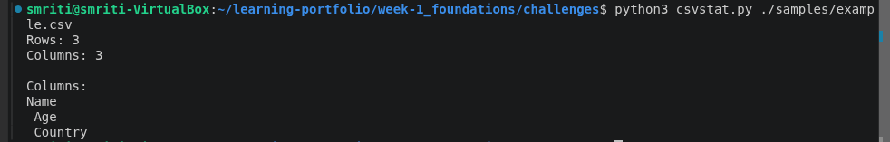
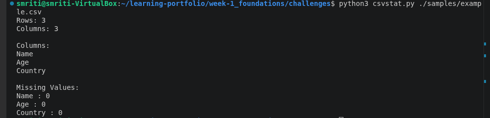
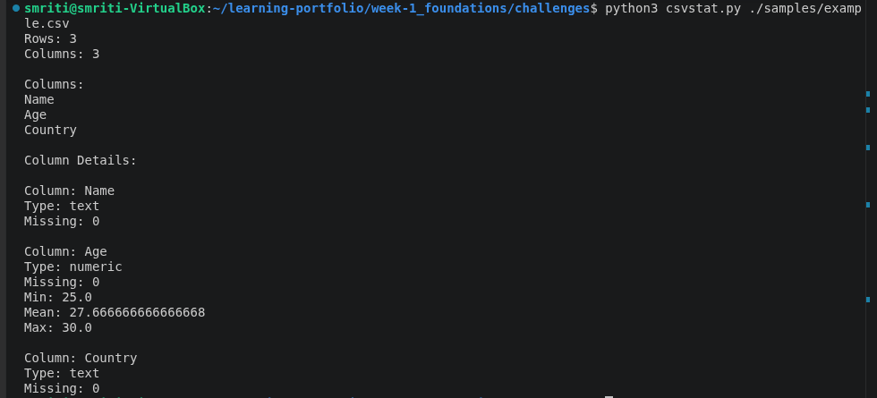
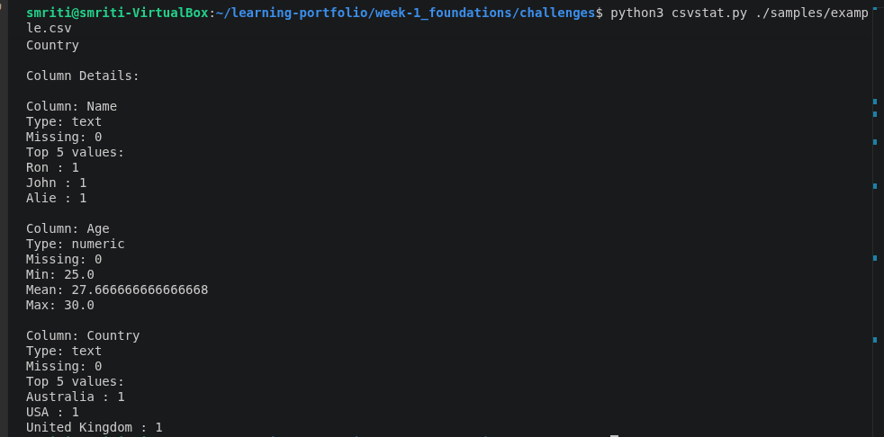
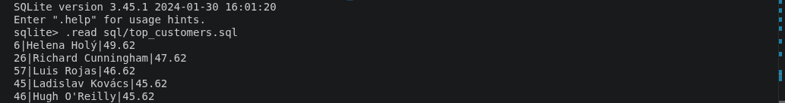
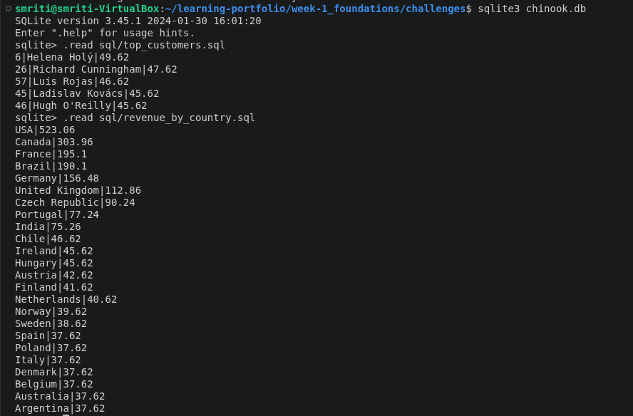
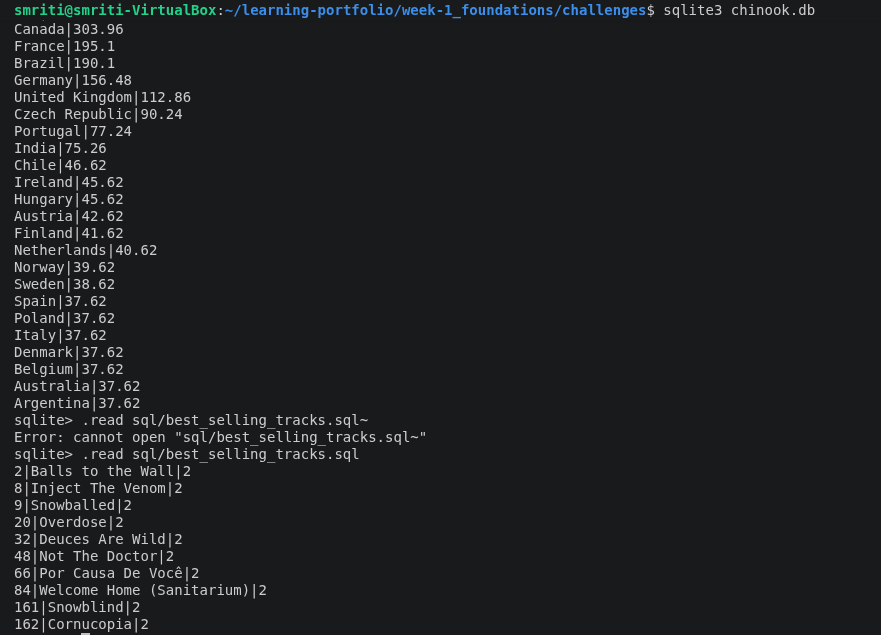
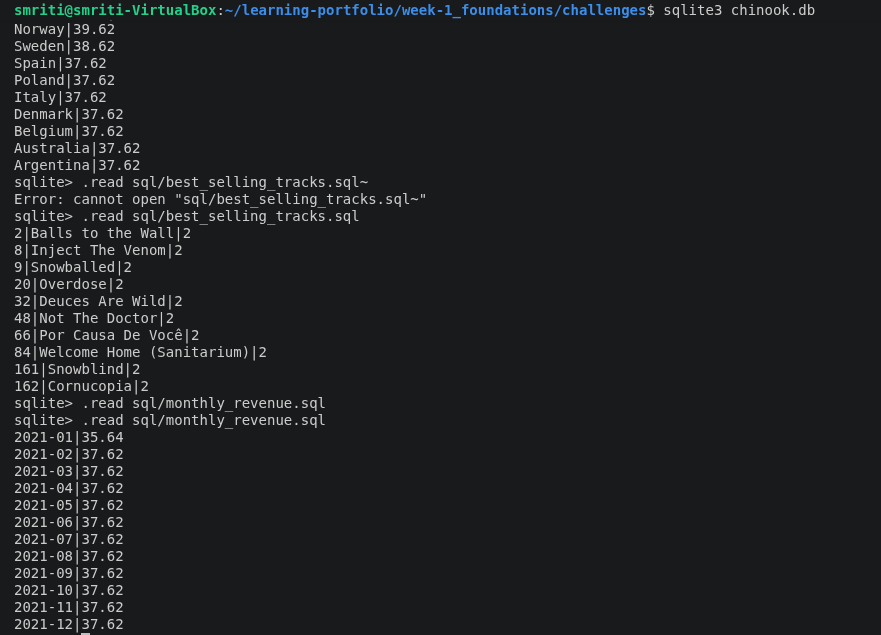

# Weekly Challenge – CSV Profiling Tool & SQL Analysis

## Overview

This weekly challenge focuses on building a command-line CSV profiling tool using Python and performing SQL-based data analysis using the Chinook database.

The challenge helped in understanding data processing, data quality analysis, command-line applications, SQL querying, and extracting insights from structured datasets.

---

# Problem Statement

The objective of this challenge was divided into two parts:

## Part A – CSV Profiling Tool

Build a reusable command-line tool (`csvstat`) that accepts a CSV file and generates useful profiling information including:

- Dataset size
- Column information
- Data type detection
- Missing value analysis
- Numerical statistics
- Frequent values analysis

## Part B – SQL Analysis

Analyze the Chinook database and answer business-related questions using SQL queries:

- Top customers by total spending
- Revenue by country
- Best-selling tracks
- Monthly revenue trends

---

# Objectives

- Build a CSV analysis tool using Python.
- Accept file paths using command-line arguments.
- Analyze CSV structure and data quality.
- Detect numeric, text, and date columns.
- Calculate missing value percentage.
- Generate numerical statistics.
- Implement top-N frequent value analysis.
- Perform SQL-based business analysis.
- Practice SQL joins, grouping, and aggregation.

---

# Technologies Used

- Python 3
- SQLite
- SQL
- Ubuntu Linux
- Visual Studio Code
- Git
- Markdown

---

# Implementation

## Part A – CSV Profiling Tool (`csvstat`)

### Features Implemented

- Accepted CSV file path using `argparse`.
- Counted number of rows and columns.
- Detected column data types:
  - Numeric
  - Text
  - Date
- Calculated missing values:
  - Count
  - Percentage
- Generated numerical statistics:
  - Minimum
  - Mean
  - Maximum
- Added `--top N` option for frequent text values.
- Added friendly error handling for invalid files.

### Running the Tool

Basic profiling:

```bash
python3 csvstat.py samples/example.csv
```

With top values:

```bash
python3 csvstat.py samples/example.csv --top 5
```

---

# Part B – SQL Analysis Using Chinook Database

## 1. Top Customers by Total Spending

Calculated the customers with the highest spending using:

- JOIN
- GROUP BY
- SUM()
- ORDER BY
- LIMIT


## 2. Revenue by Country

Calculated total revenue generated from different countries using aggregation and sorting.


## 3. Best-Selling Tracks

Identified top tracks based on purchase quantity using joins and aggregation.


## 4. Monthly Revenue Analysis

Calculated monthly revenue trends from invoice data.

---

# Screenshots

## Part A – CSV Profiling Tool

### Row and Column Count


### Column Analysis



### Datatype Detection



### Numeric Statistics



### Top Value Frequency




---

## Part B – SQL Analysis

### Top Customers



### Revenue By Country



### Best Selling Tracks



### Monthly Revenue



---

# Learning Outcomes

Through this challenge, I learned:

- Building command-line tools using Python.
- Processing CSV datasets.
- Understanding data profiling concepts.
- Handling missing and inconsistent data.
- Writing analytical SQL queries.
- Using JOIN and aggregate functions.
- Debugging database schema issues.
- Organizing technical work using Git and Markdown.

---

# Resources Used

- Python Documentation  
  https://docs.python.org/3/

- SQLite Documentation  
  https://www.sqlite.org/docs.html

- Chinook Database  
  https://github.com/lerocha/chinook-database

- Git Documentation  
  https://git-scm.com/doc

---

# Conclusion

This weekly challenge provided practical experience in Python-based data processing and SQL-based analytics.

By developing the CSV profiling tool and analyzing the Chinook database, I gained hands-on understanding of data quality checks, command-line applications, SQL querying techniques, and real-world data analysis workflows.