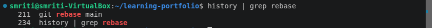
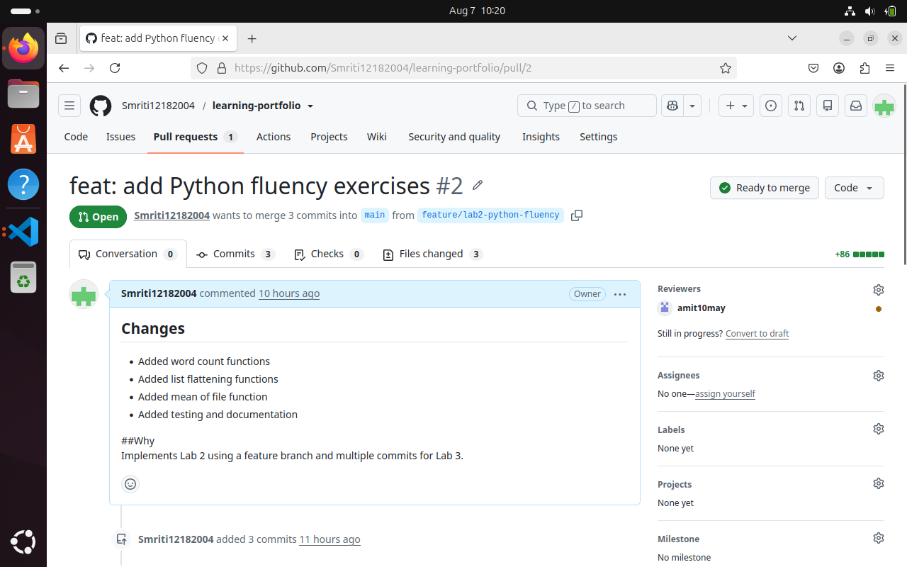

# Lab 03 – GitHub and Git Workflow

## Overview

This lab focuses on understanding Git version control and GitHub collaboration workflows. The objective was to gain practical experience with repository management, branching strategies, commits, remote repositories, pull requests, and maintaining a structured development workflow.

The lab demonstrates how developers collaborate on projects using Git and GitHub by creating isolated branches, tracking changes through commits, and integrating work using pull requests.

---

# Objectives

The main objectives of this lab were:

- Understand the fundamentals of Git version control.
- Learn how to manage repositories using Git commands.
- Create and work with feature branches.
- Practice committing changes with meaningful messages.
- Push local changes to GitHub repositories.
- Create and manage pull requests.
- Understand Git history and change tracking.

---

# Lab Tasks Completed

## 1. Repository Setup

- Initialized and managed a Git repository.
- Connected the local repository with a remote GitHub repository.
- Maintained an organized project structure.

---

## 2. Branch Management

A separate branch was created for Lab 03 development to ensure changes were isolated from the main branch.

### Workflow Followed

```
Main Branch
      |
      |
      v
Feature Branch
      |
      |
      v
Development Changes
      |
      |
      v
Commits
      |
      |
      v
Pull Request
      |
      |
      v
Merged into Main
```

This workflow helps maintain clean project history and allows safe collaboration between multiple contributors.

---

## 3. Commit Management

Changes were tracked using Git commits with descriptive commit messages.

Practiced:

- Adding new files.
- Updating project documentation.
- Tracking implementation changes.
- Reviewing previous commits using Git history.

---

## 4. Pull Request Workflow

The GitHub collaboration workflow was practiced:

Steps followed:

1. Created a separate branch for development.
2. Added required files and changes.
3. Created commits with meaningful messages.
4. Pushed the branch to GitHub.
5. Created a Pull Request.
6. Reviewed and merged changes.

---

# Git Commands Practiced

| Command | Description |
|---------|-------------|
| `git init` | Initialize a new Git repository |
| `git clone` | Clone a remote repository |
| `git status` | Check repository status |
| `git add` | Stage changes for commit |
| `git commit` | Save changes with commit message |
| `git branch` | Create and manage branches |
| `git checkout` | Switch between branches |
| `git log` | View commit history |
| `git remote` | Manage remote repositories |
| `git push` | Upload changes to GitHub |
| `git pull` | Fetch and merge remote updates |

---

# Git Workflow Demonstration

## 1. Git Commit History

The commit history shows the sequence of changes made during development and helps track project progress.


---

## 2. Git Rebase / Branch Management

Git rebase was explored to understand branch history management and maintaining a cleaner commit timeline.



---

## 3. Pull Request Creation

A Pull Request was created to merge changes from the development branch into the main branch following the standard GitHub workflow.



---

# Key Learnings

Through this lab, I gained practical experience in:

- Understanding Git version control concepts.
- Managing code using branches.
- Creating structured commits.
- Working with remote GitHub repositories.
- Using pull requests for collaboration.
- Reviewing project history using Git logs.
- Understanding professional software development workflows.

---

# Challenges Faced

During the workflow, challenges related to branch management, file organization, and repository restructuring were encountered.

These challenges helped improve understanding of:

- Git history tracking.
- Recovering previous changes using commits.
- Managing files safely during repository modifications.

---

# Conclusion

This lab provided hands-on experience with Git and GitHub workflows used in real-world software development environments.

By completing this lab, I learned how to manage repositories effectively, work with branches, track changes, and collaborate using GitHub pull requests while following professional development practices.
