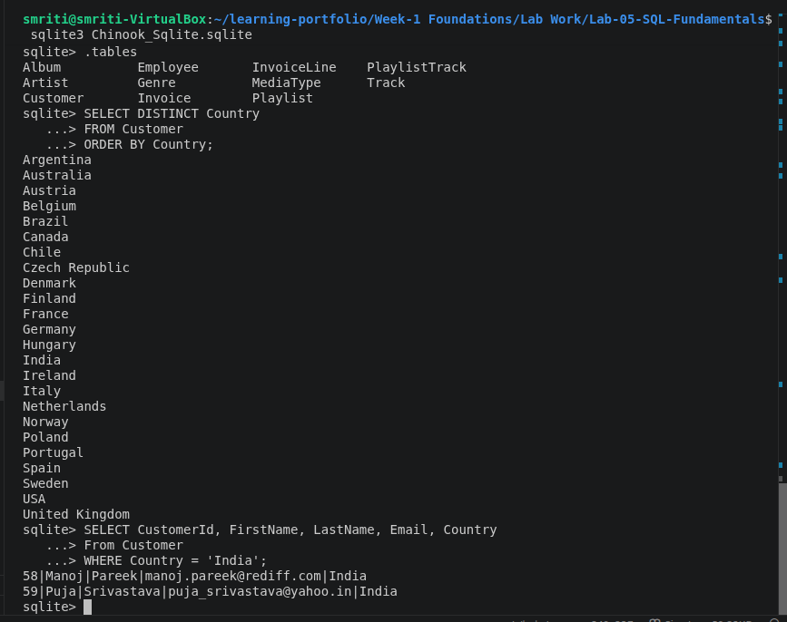
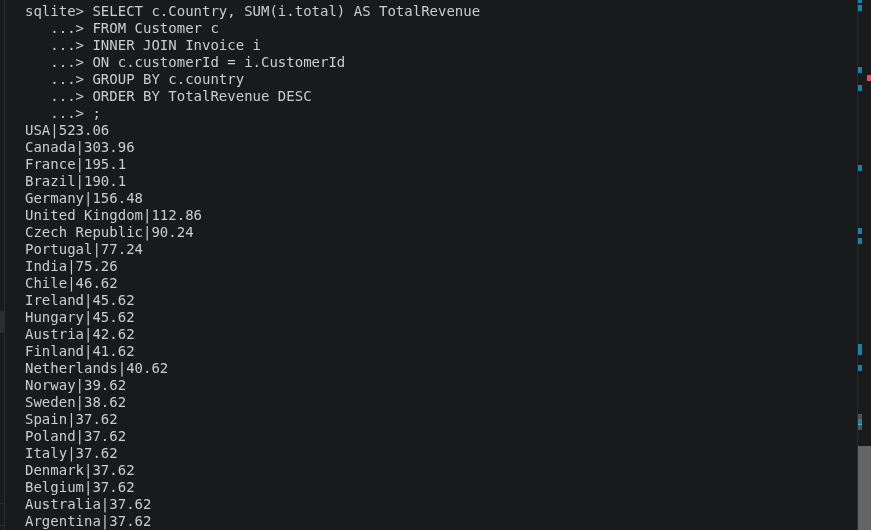
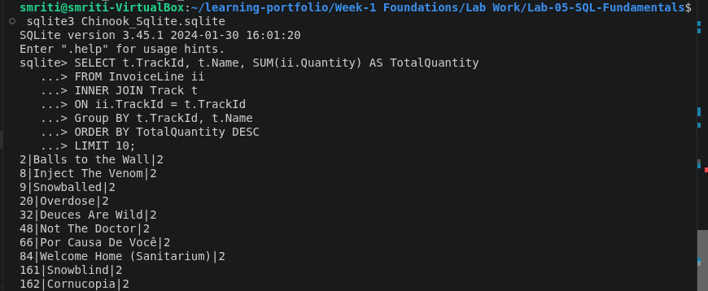
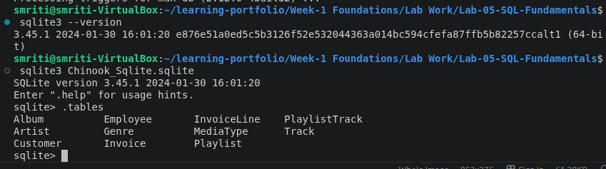

# Lab 05 – SQL Fundamentals

## Overview

This lab focuses on learning SQL fundamentals by working with a relational database using SQLite. It covers database exploration, writing SQL queries, performing data analysis, applying filtering and aggregation operations, and extracting meaningful insights from the Chinook database.

---

## Problem Statement

The objective of this lab was to analyze a relational database using SQL queries. The task required exploring database tables, understanding relationships between entities, writing SQL scripts for different analytical problems, performing calculations using SQL functions, and documenting query outputs for future reference.

---

## Objectives

- Understand relational database structure.
- Explore tables and relationships in the Chinook database.
- Create and execute SQL queries.
- Retrieve data using `SELECT` statements.
- Filter and sort records using SQL conditions.
- Perform aggregation using SQL functions.
- Analyze data using grouping operations.
- Use joins to combine information from multiple tables.
- Document SQL queries and outputs with screenshots.

---

## Technologies Used

- Ubuntu Linux
- SQLite
- SQL
- Chinook Database
- Visual Studio Code
- Git
- GitHub

---

## Repository Structure

```
Lab-05-SQL-Fundamentals/
│
├── README.md
├── Chinook_Sqlite.sqlite
│
├── sql/
│   ├── 01_customer_by_country.sql
│   ├── 02_most_expensive_tracks.sql
│   ├── 03_revenue_by_country.sql
│   ├── 04_best_selling_tracks.sql
│   └── 05_monthly_revenue_2021.sql
│
└── screenshots/
    ├── 01_customer_by_country.png
    ├── 02_most_expensive_tracks.png
    ├── 03_revenue_by_country.png
    ├── 04_best_selling_tracks.png
    ├── 05_monthly_revenue_2021.png
    └── database_tables.png

```

---

## Implementation

### Step 1: Database Setup

The Chinook SQLite database was used for performing SQL analysis.

The database contains information about:

- Customers
- Employees
- Artists
- Albums
- Tracks
- Genres
- Invoices
- Invoice Items

---

### Step 2: Database Exploration

The database structure was explored to understand available tables and relationships between different entities.

Database tables were analyzed before writing SQL queries.

---

### Step 3: SQL Query Implementation

Different SQL scripts were created to perform analysis on the database.

---

### Query 1: Customer Analysis by Country

File:

```
01_customer_by_country.sql
```

Purpose:

- Count customers from different countries.
- Analyze customer distribution.

---

### Query 2: Most Expensive Tracks

File:

```
02_most_expensive_tracks.sql
```

Purpose:

- Identify tracks with the highest prices.
- Sort tracks according to unit price.

---

### Query 3: Revenue Analysis by Country

File:

```
03_revenue_by_country.sql
```

Purpose:

- Calculate total revenue generated from different countries.
- Analyze revenue contribution by region.

---

### Query 4: Best Selling Tracks

File:

```
04_best_selling_tracks.sql
```

Purpose:

- Identify tracks with maximum sales.
- Analyze track popularity.

---

### Query 5: Monthly Revenue Analysis

File:

```
05_monthly_revenue_2021.sql
```

Purpose:

- Calculate monthly revenue trends for 2021.
- Analyze revenue changes over time.

---

## SQL Queries Used

The following SQL concepts were implemented:

```
SELECT
WHERE
ORDER BY
GROUP BY
HAVING
COUNT()
SUM()
AVG()
MIN()
MAX()
INNER JOIN
LEFT JOIN
```

---

## Output

### Query Execution

SQL scripts were executed on the Chinook SQLite database to generate analytical results.

The queries successfully produced outputs for:

- Customer analysis by country.
- Most expensive tracks.
- Revenue generated by country.
- Best selling tracks.
- Monthly revenue trends.

---

## Screenshots

### 1. Customer Analysis by Country



---

### 2. Most Expensive Tracks


---

### 3. Revenue Analysis by Country



---

### 4. Best Selling Tracks



---

### 5. Monthly Revenue Analysis 2021


---

### 6. Database Tables



---

## Learning Outcomes

After completing this lab, I learned how to:

- Understand relational database concepts.
- Explore database tables and relationships.
- Write SQL queries for data retrieval and analysis.
- Apply filtering, sorting, and aggregation techniques.
- Use SQL joins to combine data from multiple tables.
- Analyze structured data using SQLite.
- Organize SQL scripts for different analytical tasks.
- Document database workflows using Markdown.

---

## Resources Used

- SQLite Documentation
- SQL Documentation
- Chinook Database Documentation
- Git Documentation
- GitHub Documentation
- Visual Studio Code Documentation

---

## Conclusion

This lab provided practical experience in working with relational databases and SQL queries. It strengthened my understanding of database structures, data retrieval, analysis techniques, and extracting meaningful insights using SQL fundamentals.
