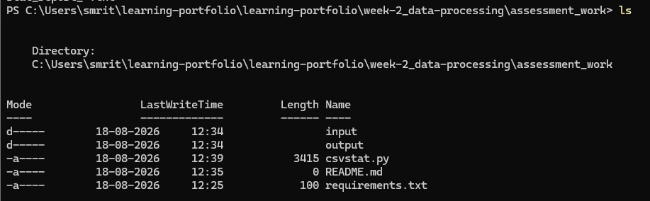
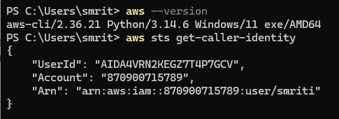
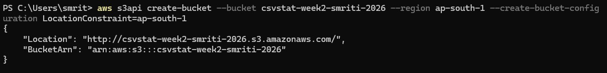
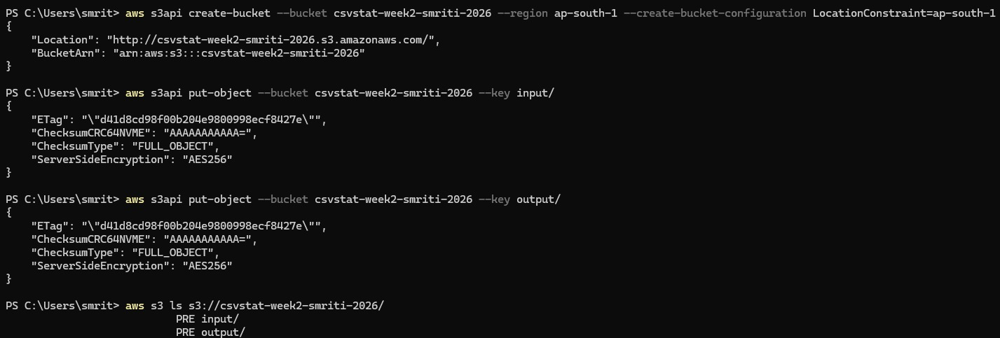
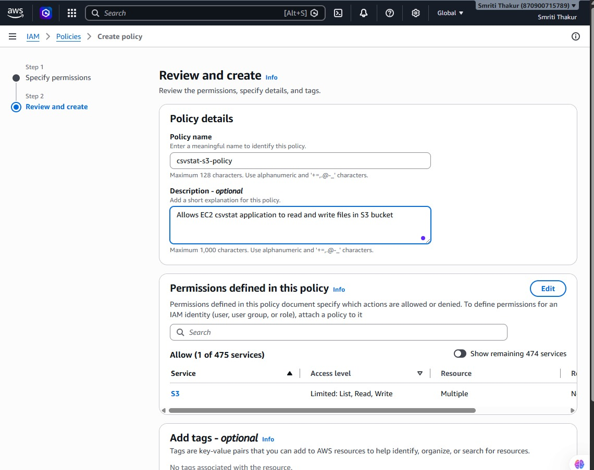
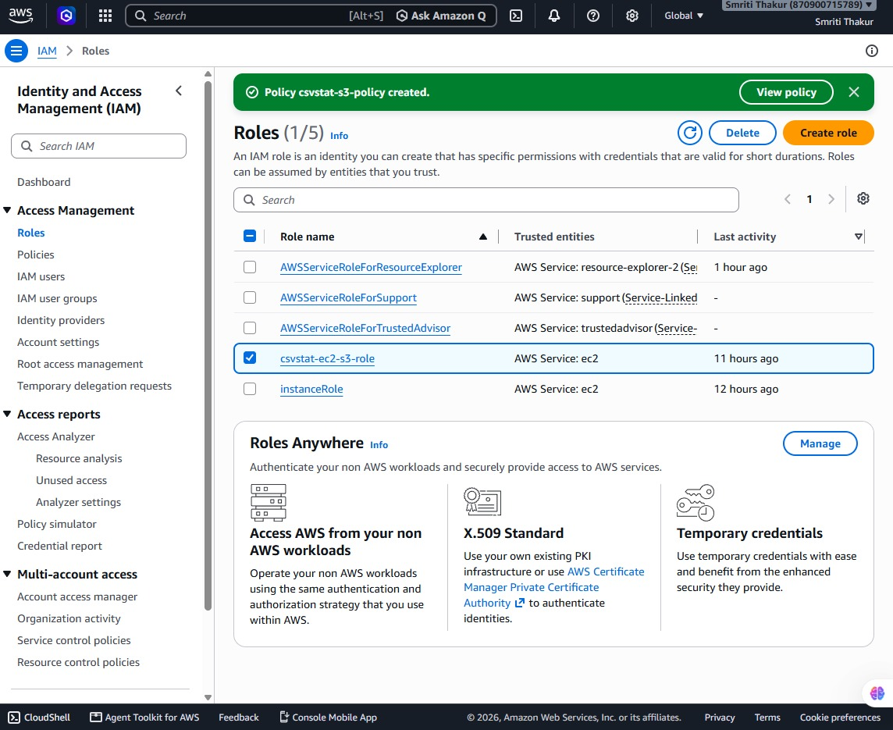
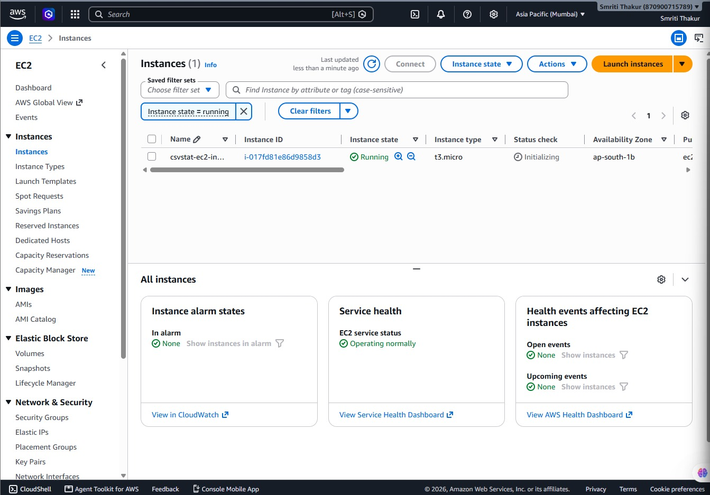
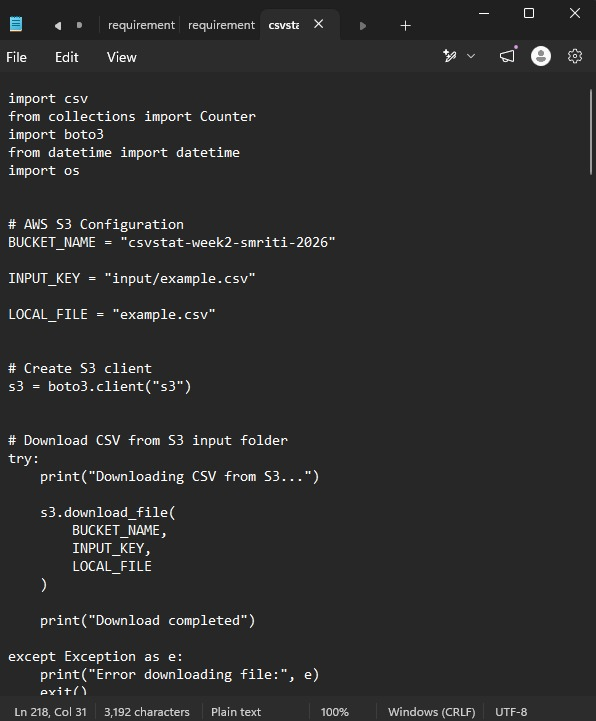

# CSVStat on AWS - Week 2 Assessment

## Objective

The objective of this assessment is to extend the Week 1 `csvstat` CSV profiling tool by integrating it with AWS services.

The application was deployed on an Amazon EC2 instance and uses Amazon S3 for input and output file storage.

This assessment demonstrates:

- Working with Amazon S3
- Working with Amazon EC2
- Using Python and Boto3
- Reading CSV data from S3
- Performing CSV profiling
- Uploading generated reports back to S3


---

# Architecture Overview

```
CSV File
    |
    ↓
Amazon S3 Input Folder
    |
    ↓
Amazon EC2 Instance
    |
    ↓
Python CSVStat Application
    |
    ↓
Generate CSV Report
    |
    ↓
Amazon S3 Output Folder
```


---

# Technologies Used

| Technology | Purpose |
|------------|---------|
| Python | Application development |
| Boto3 | AWS SDK for Python |
| Amazon S3 | CSV input and report storage |
| Amazon EC2 | Application execution environment |
| AWS IAM | Secure access management |
| AWS CLI | AWS resource management |
| Git | Version control |

---

# Project Structure

```
assessment_work
│
├── input
│   └── example.csv
│
├── output
│   └── csvstat_report_<timestamp>.txt
│
├── screenshots
│
├── csvstat.py
├── requirements.txt
└── README.md
```





---

# AWS Configuration

## 1. AWS CLI Setup

AWS CLI was configured using:

```bash
aws configure
```

Configuration:

```
Region: ap-south-1
Output format: json
```

Verification:

```bash
aws sts get-caller-identity
```


Screenshot:




---

# 2. Amazon S3 Setup

Created S3 bucket:

```
csvstat-week2-smriti-2026
```


Bucket structure:

```
csvstat-week2-smriti-2026

├── input/
│     └── example.csv
│
└── output/
      └── csvstat_report.txt
```


The input CSV file is uploaded to:

```
s3://csvstat-week2-smriti-2026/input/example.csv
```


Generated reports are stored in:

```
s3://csvstat-week2-smriti-2026/output/
```


Screenshots:







---
## 3. IAM Role Setup

Created IAM role:

csvstat-ec2-s3-role

Purpose:

The IAM role allows the EC2 instance to securely access S3 resources.

Attached policy:

csvstat-s3-policy

The policy follows the principle of least privilege and allows only required S3 actions:

- s3:ListBucket
- s3:GetObject
- s3:PutObject

Screenshots:





---

# 4. EC2 Instance Setup

An EC2 instance was created for running the CSVStat application.

Configuration:

| Configuration | Details |
|---|---|
| AMI | Amazon Linux 2023 |
| Instance Type | t3.micro |
| Region | ap-south-1 |

The IAM instance profile was attached to the EC2 instance to allow secure S3 access.

(Note: The EC2 instance was terminated after completing the assessment.)


Screenshot:




---

# Application Implementation

## Boto3 S3 Integration

The application uses Boto3 to connect with Amazon S3.

Implemented operations:

- Download CSV from S3 input folder
- Process CSV data
- Generate report
- Upload report to S3 output folder


Code implementation:




---

# CSV Processing Workflow

## Step 1: Download CSV

The application downloads:

```
s3://csvstat-week2-smriti-2026/input/example.csv
```


Using:

```python
s3.download_file()
```


## Step 2: CSV Profiling

The tool performs:

- Row count
- Column count
- Column names
- Data type detection
- Missing value detection
- Numeric statistics
- Top values for text columns


## Step 3: Generate Report

Generated report:

```
csvstat_report_<timestamp>.txt
```


## Step 4: Upload Report

Report uploaded to:

```
s3://csvstat-week2-smriti-2026/output/
```


---

# Installation and Execution

Install dependencies:

```bash
pip install -r requirements.txt
```


Run:

```bash
python csvstat.py
```


Expected output:

```
Downloading CSV from S3...

Download completed

Report generated successfully

Report uploaded to S3 successfully

CSVStat execution completed
```
---

# Learning Outcomes

- Learned AWS S3 integration with Python
- Learned EC2 based application execution
- Learned IAM role based access management
- Learned Boto3 automation for AWS services
- Built a complete cloud-based CSV processing workflow
